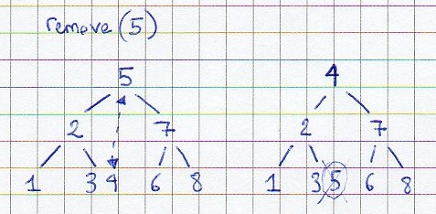

!SLIDE center
##Let's code a B-tree

Red Tree - Los Glaciares National Park (<a rel="cc:attributionURL" property="cc:attributionName" href="http://www.fotopedia.com/users/80RxsWcKz0M">Javier Vidal</a>) / <a rel="license" href="http://creativecommons.org/licenses/by/2.0/">CC BY 2.0</a>

!SLIDE subsection
# What is a B-tree?
(and why would I want one?)

!SLIDE
[http://en.wikipedia.org/wiki/B-tree](http://en.wikipedia.org/wiki/B-tree):

> A tree data structure that **keeps data sorted** and allows searches, sequential access, insertions and deletions in **logarithmic time** [...] optimized for systems that read and write **large blocks of data**.

!SLIDE subsection
# Logarithmic time???

!SLIDE
# Asymptotic complexity
* RAM (Random Access Machine) model: one basic operation (+, =...) => one time step
* For a given algorithm:
  * total number of time steps = f(input size)
  * notation for worst-case complexity: O(f(n))

!SLIDE center
# Orders of magnitude
Assuming 1 time step = 1 nanosecond:

[http://www.cs.sunysb.edu/~skiena/373/newlectures/lecture3.pdf](http://www.cs.sunysb.edu/~skiena/373/newlectures/lecture3.pdf)

!SLIDE subsection
# Searchable data structures

!SLIDE center
# Unsorted array
* insertion (append): O(1)

* search (sequential traversal): O(n)

!SLIDE center
# Sorted array
* binary search: O(log n)

* insertion: O(n)

!SLIDE center
# Binary tree
* best case: O(log n)
* worst case (unbalanced): O(n)

!SLIDE center
# Self-balancing binary tree
* mutative operations include steps to keep the tree balanced
* various implementations provide search, insertion and removal in O(log n)

  Ex: `java.util.TreeMap` => red-black tree

!SLIDE center
##If self-balancing binary trees already provide all operations in O(log n), what do we need B-trees for?

!SLIDE
# Memory locality
The limits of the RAM model

* memory access is not constant
  * disk blocks
  * virtual memory pages
  * (cache lines)
* when accessing values sequentially, performance will benefit if these values are stored in nearby memory locations

!SLIDE subsection
# B-tree definition

!SLIDE center smaller
# B-tree of degree m
* each node has between _m/2_ and _m_ children
* the root has at least two children if it is not a leaf node
* a non-leaf node with _k_ children contains _k-1_ keys
* all leaves appear at the same level, and carry information

!SLIDE center
# Implementation
* children: array of size m + 1 (extra bucket will simplify some operations)
* keys: array of size m/2 + 1
* use raw types, expose typesafe API

!SLIDE subsection
# Uses of B-trees

!SLIDE
# Database indices

    @@@javascript
    > db.users.ensureIndex( {age: 1} );
    
    > db.users.find( {age: {$gte: 18,
                            $lt: 50}} )
              .explain();

    {
      "cursor" : "BtreeCursor age_1",
      ...
    }

!SLIDE center
# File systems

* map file blocks to disk blocks
* HFS+, NTFS, ext4

!SLIDE subsection
# Algorithms
[http://en.wikipedia.org/wiki/B-tree#Algorithms](http://en.wikipedia.org/wiki/B-tree#Algorithms)
[http://fr.wikipedia.org/wiki/Arbre_B#Op.C3.A9rations](http://fr.wikipedia.org/wiki/Arbre_B#Op.C3.A9rations)

!SLIDE center
# Search
Find target node, then key (sequential or binary search)

!SLIDE center
# Add
When target node not full: insert key, moving other keys if necessary

!SLIDE center
# Add
When target node full: move median key to upper level, split remaining keys into two child nodes

!SLIDE center
# Add
Splits can bubble up the tree

!SLIDE center
# Remove
Removing from a leaf: simply delete the key.

!SLIDE center
# Remove
Removing from an internal node: swap key with righmost leaf key of left child, or leftmost leaf key of right child => back to previous case

!SLIDE center
# Rebalance
A removal can leave the tree in an inconsistent state. There are various ways to rebalance it

!SLIDE center
# Rebalance
Steal from a sibling that has enough keys, "rotating" through the parent

!SLIDE center
# Rebalance
If there are no siblings or they both have the minimum cardinality, merge with a sibling, stealing the separating key from the parent

!SLIDE center
# Rebalance
Merges also propagate up the tree

!SLIDE center
# Removal
If the root node is empty, replace it with its unique child.

!SLIDE subsection
# Your turn!
